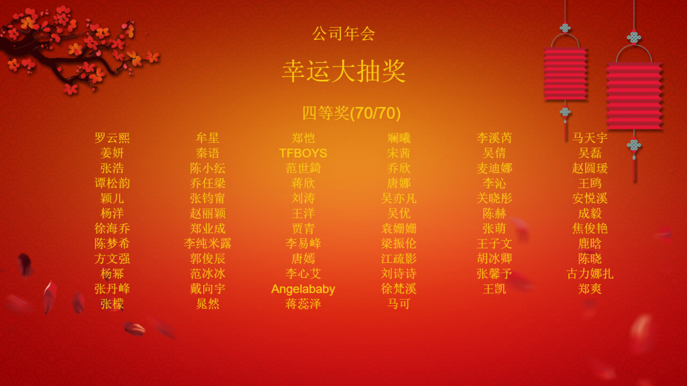

# lucky-lottery
年会抽奖软件



> 使用手册

```sh
git clone http://github.com/dungang/lucky-lottery.git
cd lucky-lottery
#安装依赖包
npm install
#启动项目
npm start
#或者打包win32
npm run-script package
```

- 在data/users.txt,添加用户的名称，每行一个名称
- 修改配置文件 config.js 文件有备注
- 背景图片路径 images
- 退出 ctrl+q 
- 打开调试窗口 ctrl+i
- 选择一个奖项：alt+n
- 开始抽奖：alt+s
- 停止抽奖：alt+c

> 结果保存

抽奖结果自动截图，默认保存在 d:/lottery/
可以在配置文件中修改，设置其他路径
还可以查看日子文件 log/log.txt

> 编辑配置

```javascript

 {
     //默认字体颜色
    fontColor: '#fdd312',
    //背景图片
    background:'images/bg-1.png',

    title: '公司年会',
    titleFontSize: '32px',
    titleColor:'#fdd312',

    subTitle: '幸运大抽奖',
    subTitleFontSize: '50px',
    subTitleColor:'#fdd312',
    
    rewardTitleFontSize:'32px',
    rewardTitleColor:'#fdd312',
    rewardAreaTop: "0", //10%
    rewardWelcomeMessage: "激动人心的时刻即将开始！",

    onceEndMessage:"本轮抽奖结束，更多精彩在下一轮！",
    allEndMessage:"抽奖全部结束，新年快，恭喜发财!",

    //抽奖滚动时长 单位秒，自动停止,0表示只能手动停止
    //本系统手动停止始终存在
    rollingTime:0, 

    resultPath:'d:/lottery/', //结果截图保存路径
    tasks:[
        //一个任务可以添加多抽奖活动，
        //每个抽奖活动消费一定数量的人员，
        //消费的人员不出现在后面的活动中
        //每个任务使用 users.txt中的名单
        {
            title:'开心百分百',
            except:['胡歌','张铭恩'], //排除users.txt中的名单
            rewards:[
                {
                    title:'四等奖',  //奖项名称
                    count:70,     //奖项数量
                    capacity:70,//一次抽取数量[1，count]
                    namesOfLine:6  //获奖区每行显示几个名字 [1,2,3,4,6,12]
                },
                {
                    title:'三等奖', //奖项名称
                    count:5,     //奖项数量
                    capacity:5,//一次抽取数量[1，count]
                    namesOfLine:1//获奖区每行显示几个名字 [1,2,3,4,6,12]
                },
                {
                    title:'二等奖',  //奖项名称
                    count:5,//奖项数量
                    capacity:5,//一次抽取数量[1，count]
                    namesOfLine:1   //获奖区每行显示几个名字 [1,2,3,4,6,12]
                },
                {
                    title:'一等奖', //奖项名称
                    count:5,     //奖项数量
                    capacity:5,//一次抽取数量[1，count]
                    namesOfLine:1    //获奖区每行显示几个名字 [1,2,3,4,6,12]
                }
            ]
        },
        
        {
            title:'幸运百分百',
            except:['胡歌','李易峰'], //排除users.txt中的名单
            rewards:[
                {
                    title:'幸运奖', //奖项名称
                    count:1,     //奖项数量
                    capacity:1,  //一次抽取数量[1，count]
                    namesOfLine:1 //获奖区每行显示几个名字 [1,2,3,4,6,12]
                }
            ]
        }
    ]

}

```

如果软件对您有用，你也可以捐赠此软件的开发,

非常感谢，祝您中大奖


MIT License

Copyright (c) 2017 dungang

Permission is hereby granted, free of charge, to any person obtaining a copy
of this software and associated documentation files (the "Software"), to deal
in the Software without restriction, including without limitation the rights
to use, copy, modify, merge, publish, distribute, sublicense, and/or sell
copies of the Software, and to permit persons to whom the Software is
furnished to do so, subject to the following conditions:

The above copyright notice and this permission notice shall be included in all
copies or substantial portions of the Software.

THE SOFTWARE IS PROVIDED "AS IS", WITHOUT WARRANTY OF ANY KIND, EXPRESS OR
IMPLIED, INCLUDING BUT NOT LIMITED TO THE WARRANTIES OF MERCHANTABILITY,
FITNESS FOR A PARTICULAR PURPOSE AND NONINFRINGEMENT. IN NO EVENT SHALL THE
AUTHORS OR COPYRIGHT HOLDERS BE LIABLE FOR ANY CLAIM, DAMAGES OR OTHER
LIABILITY, WHETHER IN AN ACTION OF CONTRACT, TORT OR OTHERWISE, ARISING FROM,
OUT OF OR IN CONNECTION WITH THE SOFTWARE OR THE USE OR OTHER DEALINGS IN THE
SOFTWARE.